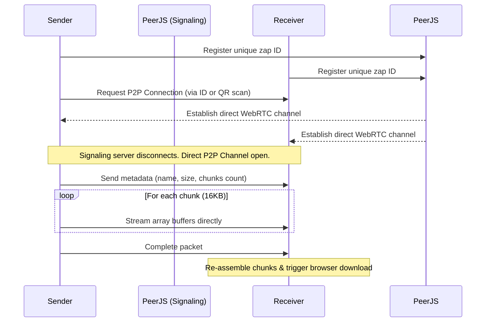

# 🚀 ZapDrop — P2P File Transfer (v2.0.0)

[](https://vitejs.dev/)
[](https://react.dev/)
[](https://www.typescriptlang.org/)
[](https://opensource.org/licenses/MIT)

⚡ **ZapDrop** is a lightweight, zero-setup, peer-to-peer file transfer app designed to run entirely in the browser. Inspired by Apple's AirDrop, it connects devices directly using **WebRTC** so your files travel straight from one browser to another—no servers, no storage limits, and absolutely no data interception.

🔗 **Try the Live App:** [sagarlamon.github.io/zapdrop](https://sagarlamon.github.io/zapdrop/)

---

## 🤔 Why ZapDrop?

We've all faced the friction of sharing a quick photo, a video, or a large zip file between devices. Standard cloud uploads require accounts, messaging apps compress your high-res files, and USB cables are a hassle. 

ZapDrop solves this by providing:
- **Direct P2P Channels:** Data flows directly from device to device.
- **Zero Size Limits:** Send 10MB or 10GB—it transfers in 16KB stream chunks directly inside browser memory.
- **Complete Privacy:** Since no intermediary server stores your data, your files remain strictly between you and the recipient.
- **Instant Connection:** Open the link, scan the QR code with your camera, and drop your files.

---

## ✨ Key Features (v2.0.0 Upgrade)

- **⚡ Sequential Transfer Queue:** Queue up multiple files at once. ZapDrop automatically manages connection traffic and sends them sequentially to prevent WebRTC congestion.
- **📷 Built-in Camera QR Scanner:** Connect mobile devices instantly by opening the camera directly inside the browser to scan connection links.
- **📁 Folder Sharing (Auto-Zipping):** Drag and drop an entire folder structure. ZapDrop automatically zips directory contents into a single `.zip` file on-the-fly.
- **📦 Download-All Bundle:** Receive multiple files and bundle them into a single compiled `.zip` file for a one-click download.
- **📊 Real-time Stats & Speed:** Watch live transfer speeds (MB/s) and dynamic ETAs (seconds remaining) for both sending and receiving files.
- **⌛ Persistent Transfer History:** Access a beautiful local log of your last 50 transactions, saved safely inside your browser's local storage.
- **📱 PWA Offline Support:** Install ZapDrop on your home screen or desktop. It works offline without needing internet access after the initial load.
- **🔊 Sound & Toast Feedback:** Premium audio alerts and clean toast notifications when connections open, files finish, or errors occur.
- **🌗 Light & Dark Modes:** Fully tailored system theme support that respects your preferences.

---

## 🧠 How It Works



---

## 🛠 Technology Stack

- **Framework:** React 19 (TypeScript)
- **Bundler:** Vite 7 (optimized with `vite-plugin-singlefile` to pack the entire app into a self-contained HTML page)
- **Styling:** CSS variables & Tailwind CSS
- **P2P Engine:** PeerJS (WebRTC wrapper)
- **Helpers:** JSZip (Folder compression), jsQR (Camera scanner frame parsing), Lucide React (Icons)

---

## 🚀 Running Locally

If you'd like to test or customize ZapDrop on your local machine:

1. Clone or download the directory:
   ```bash
   git clone https://github.com/sagarlamon/zapdrop.git
   cd zapdrop
   ```

2. Install dependencies:
   ```bash
   npm install
   ```

3. Start the Vite local development server:
   ```bash
   npm run dev
   ```
   Open `http://localhost:5173` in your browser.

4. To compile and publish the PWA bundle:
   ```bash
   # Compile into dist/index.html
   npm run build

   # Deploy the distribution bundle to GitHub Pages
   npm run deploy
   ```

---

## 📄 License

This project is open-source and licensed under the **MIT License**. Feel free to fork it, use it, and contribute!

*Made with ⚡ by [Sagar](https://github.com/sagarlamon)*
